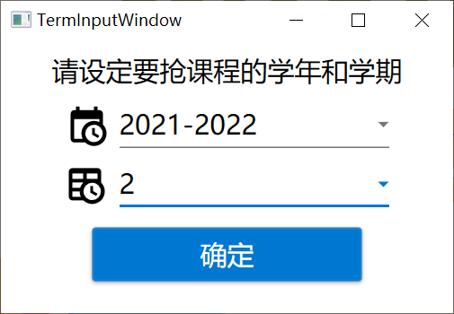
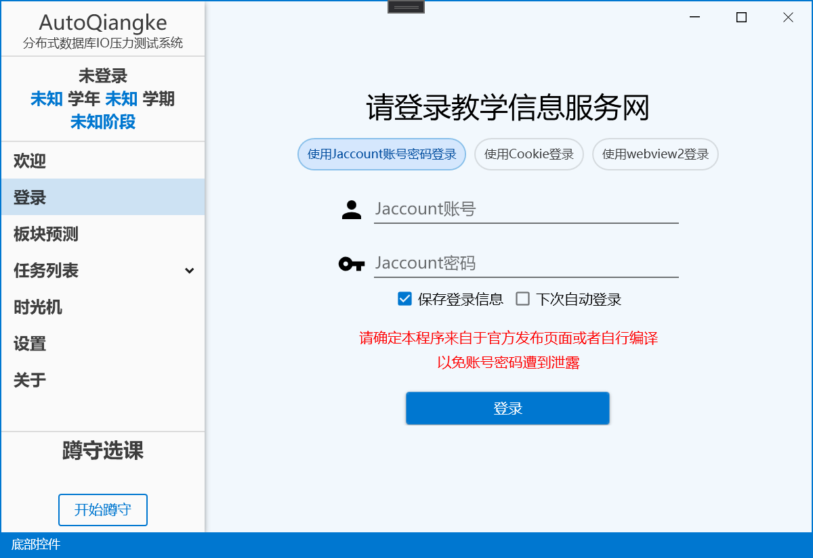
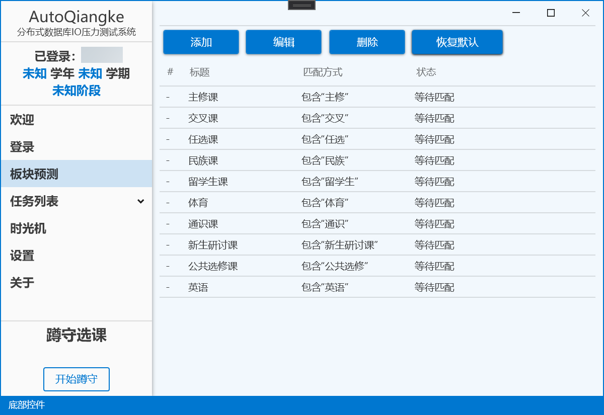
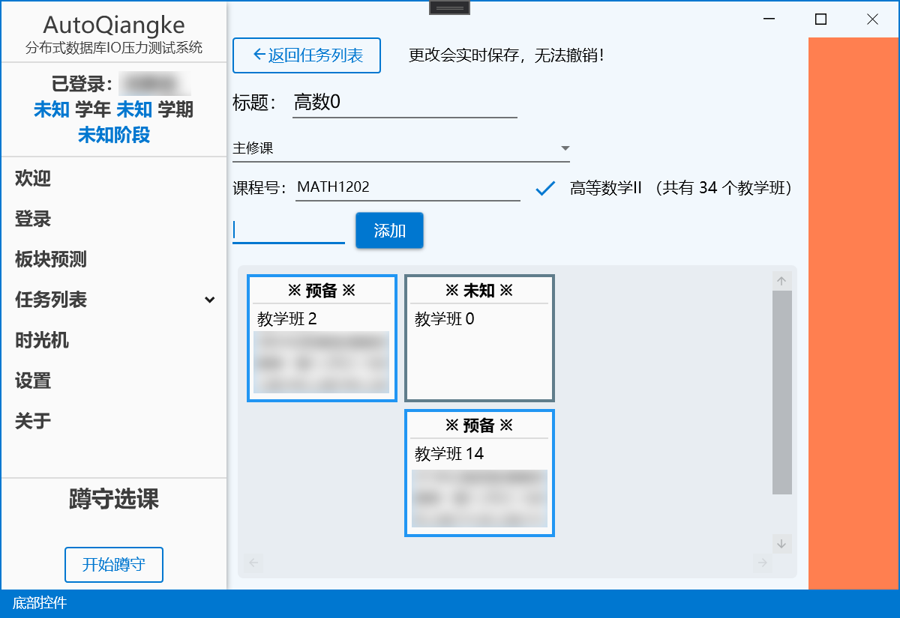

  

## 功能
- 全自动抢课
- 支持蹲守抢课和挂机捡课
- 支持自动先退课后抢课
- 多线程并发抢课
- 在选课开始前安排好抢退课的逻辑关系
- 简介明了的UI界面，不需要任何命令行操作
- 提供三种登录途径，使用Cookie登录防止账号密码泄露
- 独家的“时光机”功能，可以回到之前任意抢课时间段

## 声明
本程序需要您的身份认证（登录），一旦身份认证成功，视为您同意本程序所做的任何操作，若发生意外，后果将由您本人承担。

## 特别警告
1. 程序内置了退课的逻辑，若您的**操作失误**，可能导致选上的课被错误地退课。
 若要规避此风险，请在程序的“设置”界面勾选“禁止退课”。
2. 请不要在任务运行时修改教学班卡片的位置，以免出现上述的**操作失误**
3. 尽量避免使用复杂任务
4. 请遵守校纪校规

## 使用方法
0. 安装.NET 5 Runtime运行库 [下载地址（运行桌面应用 - x86）](https://dotnet.microsoft.com/zh-cn/download/dotnet/5.0/runtime)

1. 打开主程序，第一次启动时请填写API端点和要选课的学期学年

2. 进入主界面，登录

3. 进入“板块预测”界面，检查并修改默认的板块预测设置，使得您要选的课的板块能被匹配上

4. 进入“任务列表”界面，新建任务（同一门课，不同的教学班）或复杂任务（不同的课）

 - 对于普通任务

请选择板块，输入课程号，最下面输入教学班号（一个整数），添加

使用鼠标拖动教学班的卡片以调整位置

选课执行时，程序会从左到右判断教学班是否有余量

若左边A教学班有余量，程序将会首先退掉右侧所有教学班（若有已选的），然后尝试选该教学班

同一列的教学班优先级相同（若A、B在同一列，A可选，B已选，程序不会退掉B）

 - 对于复杂任务

最下面输入完整教学班号（比如 (2021-2022-2)-MARX1202-22 ），添加，并在卡片内选择板块

5. 返回任务列表，点击播放键启动任务

6. 点击主界面左下角开始蹲守，等待选课时间到

## 这个程序不能做到
- 无视选课规则选课（如选上已满的课）
- 提高您的网速
- 保证一定可以抢到课